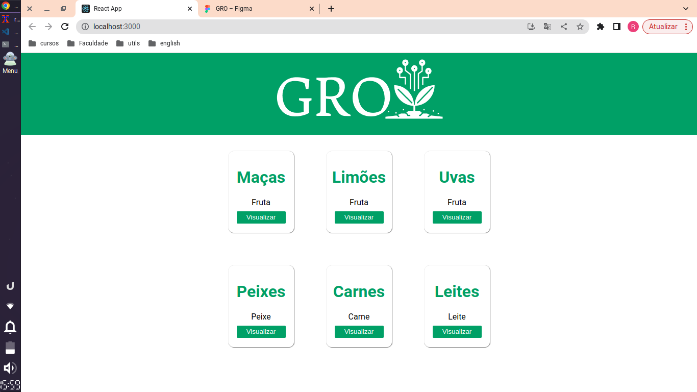

<h1 align="center">AgroTech - FIAP</h1>

# Sobre o projeto

Projeto com o foco em conectar os produtores com os consumidores, sejam eles empresas, restaurantes, mercados, vendedores locais e entre outros.O aplicativo terá um sistema b2b, em que os produtores poderão anunciar seus produtos, e os compradores poderão fazer suas ofertas e compras.O aplicativo cuidará desde a compra até a entrega final do produto, gerenciando os pagamentos e garantindo a segurança para ambos.

# Rodar o projeto

```
npm start
```

# Imagens do projeto

